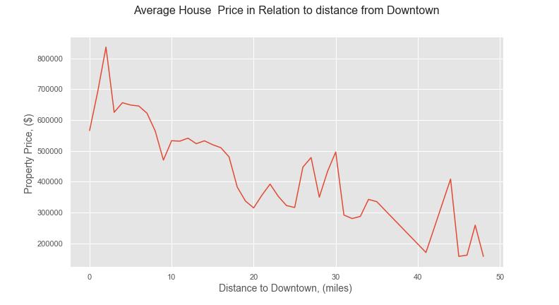
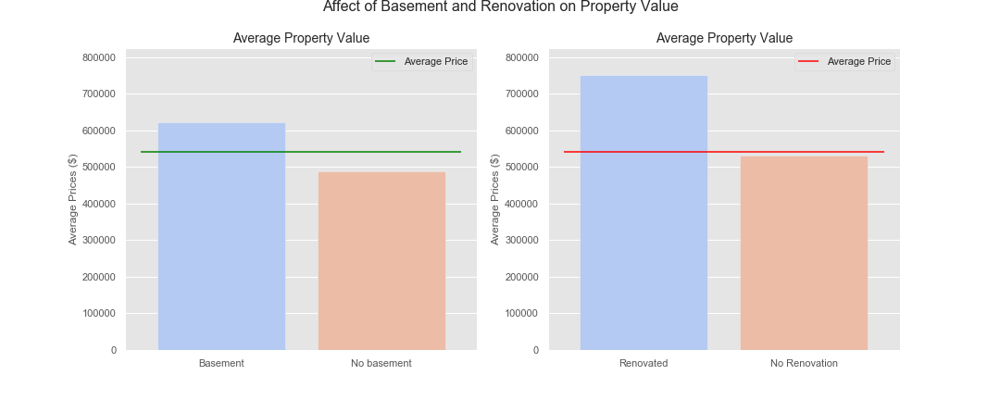

# King County Housing Price Prediction

## Overview

The pandemic has certainly affected every sector but residential real estate has been very resilient. The real estate sector has also been highly supportive of the economic recovery of the country so far. It has emerged as a pillar of support for the economy. 2020 was a record-breaking year for the US housing market. According to Zillow, in total, 5.64 million homes were sold in 2020, up 5.6% from 2019. Buyers have to face more competition and act more quickly than usual to snag their dream home. That's how hot the real estate market has been throughout the pandemic. Thankful for technologies, nowadays, we are able to create the models that will predict the price of a house given certain features such as geolocation, squre feet of living, size of basement, school rate of region etc.

This project will utilize multiple regression analysis to predict housing prices in King County, Seattle, WA. The training data will be explored for feature building and the final model will be built and trained by SciKit python library. The data and project scope was provide by Flatiron School for Data Science Immersive program phase 2 final project. 

## Repository Structure
    .
    ├── Data                                # data folder
    ├── eda.ipynd	                        # project notebook with EDA and model implementation
    ├── images                              # project image/graph files
    ├── pickle                              # final regression models pickle
    ├── modules                             # main modules of the project
    └── README.md

## Business Problem
Predict housing prices using contextual data in King County, specifically around Seattle, WA. The aim is to generate accurate sale predictions and will aid in strategizing the investment options to maximize profit for real estate companies that are interested in use this model. The multiple linear regression model will be used as the basis with provided property data for this task.

## Approach

1. Check for data completeness and integrity
2. Perform EDA with statistical analysis to determine statistically significant features
3. Visualize statistically significant features
4. Engineer new features based on stastistical findings
5. Model Linear Regression models and evaluate each model for final implementation
6. Implement feature engineering and final model to the data set. 

## Analysis
The location of the property was one of the most important factor when determining the property value. It was found that the properties located closer to downtown got hihjer average price. 

 

Analising more data we discover that having a renovated property significantly raised the average property price. Basement was a significant feature as well, but not as much as renovation.

 

Properties with condition 4 and 5 had lower average price than properties with conditions 3 and 5.

 

## Modeling
Using Scikit-learn package 3 linear regression models were crated.
- Linear Regression
- Linear Regression with Recursive Feature Eliminiation
- Linear Regression with Recursive Feature Elminiation and Cross Valdiation

## Summary

Compleated King County Housing prices data analizing, and created a prediction model. 
Determined most significant factors that affect price value - condition, renovation, distans to downtown, zip code.
The baseline of the model was created with LinearRegression method from statsmodel library. Applying Scikit-learn libraries linear regression models acchived root mean squared errors round 127k on test set and 133k on training set, means 5% performance without overfitting model. Some of the features that had the largest impact in the linear regression were dummy variables of zipcode.

